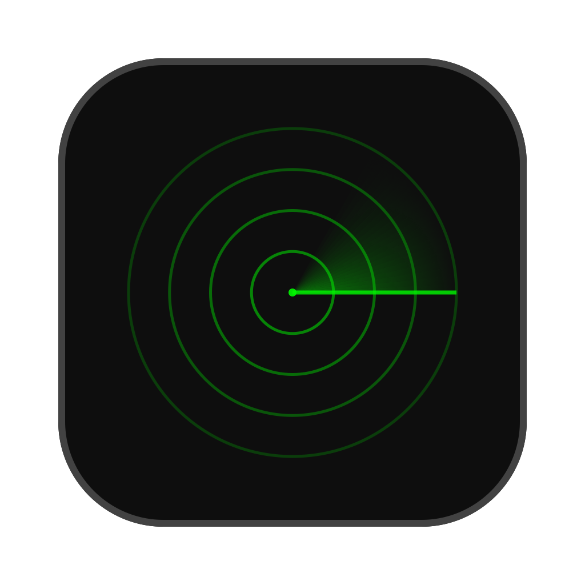
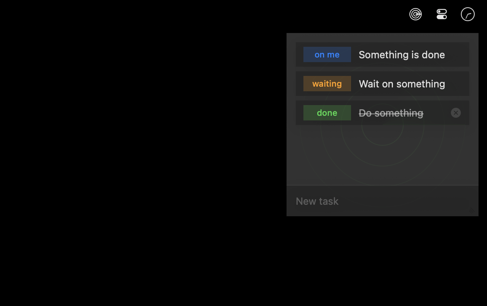

# OnMyRadar



A simple, elegant task manager that lives in your macOS menu bar. Keep track of what's on your radar with quick access to your tasks.



## Features

- **Lightning Fast** - Access your tasks instantly from the menu bar. No loading screens, no delays.
- **Minimal Interface** - Clean, focused design that stays out of your way until you need it.
- **Status Tracking** - Track tasks as "on me", "waiting", or "done" with visual indicators.
- **Keyboard Shortcuts** - Optional global hotkey support for quick access without touching the mouse.
- **Customizable** - Personalize status labels, choose symbols or text, and adjust transparency.
- **Native Performance** - Built with SwiftUI for optimal performance and battery efficiency.

## Requirements

- macOS 14.0 or later
- Apple Silicon or Intel Mac

## Installation

Download the latest release from the [Releases](https://github.com/williamparry/OnMyRadar/releases) page.

## Usage

1. Click the radar icon in your menu bar to open the task panel
2. Type to add new tasks
3. Click on tasks to edit them
4. Click status indicators to cycle through states (todo → waiting → done)
5. Right-click the menu bar icon for settings and options

## Building from Source

1. Clone the repository:
   ```bash
   git clone https://github.com/williamparry/OnMyRadar.git
   cd OnMyRadar
   ```

2. Open the project in Xcode:
   ```bash
   open "app/On My Radar.xcodeproj"
   ```

3. Build and run (⌘R)

## Website

Visit [onmyradar.williamparry.com](https://onmyradar.williamparry.com) for more information.

## License & Disclaimer

THE SOFTWARE IS PROVIDED "AS IS", WITHOUT WARRANTY OF ANY KIND, EXPRESS OR IMPLIED, INCLUDING BUT NOT LIMITED TO THE WARRANTIES OF MERCHANTABILITY, FITNESS FOR A PARTICULAR PURPOSE AND NONINFRINGEMENT. IN NO EVENT SHALL THE AUTHORS OR COPYRIGHT HOLDERS BE LIABLE FOR ANY CLAIM, DAMAGES OR OTHER LIABILITY, WHETHER IN AN ACTION OF CONTRACT, TORT OR OTHERWISE, ARISING FROM, OUT OF OR IN CONNECTION WITH THE SOFTWARE OR THE USE OR OTHER DEALINGS IN THE SOFTWARE.

## Credits

Created by [William Parry](https://williamparry.com) with assistance from Claude.